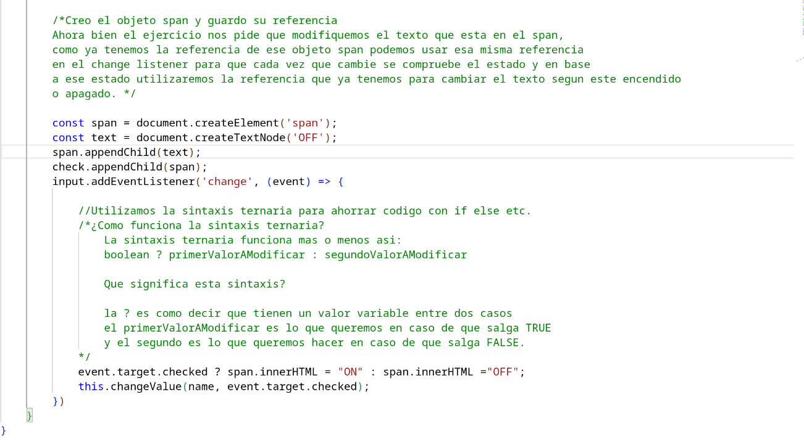

# New_Riego

### En esta primera seccion hemos hecho el primer apartado del examen. Este primer apartado consisitia en modificar el texto del checkbutton dependiendo de si su estado estuviera a false o true.

#### para la realizacion de dicho apartado unicamente he tocado el check.js

##### Captura del codigo hecho: 

