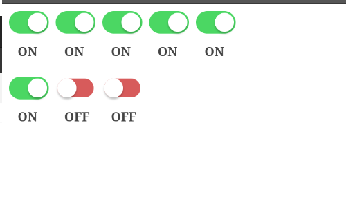

# New_Riego_Eng

### I have modified the text of the checkbutton depending on whether its state is `false` or `true`.

#### To accomplish this, I only modified `check.js`.

##### Screenshot of the implemented code:

---

### Fetching groups of valves and their corresponding valves from the server, and rendering them with the configuration provided by the server.

#### To achieve this, I created a constant `ServiceClient`, which is the object responsible for managing the connection between the client and the server. It includes a method `getChecksServed` that retrieves the valves and their groups from the server.

#### Additionally, I created a `UI` class to handle the graphical interface of the client.

##### Screenshot of the result:

#### In this image, you can see the valves created correctly, each with the state received from the server.

---

### Maintaining the state of the valves even when the page is refreshed or the tab is changed.

#### To achieve this, I created a method in my `ServiceClient` constant called `sendCheckStatus`, which is responsible for sending the valve's state to the server. On the server side, I configured it to appropriately update the data by modifying only the state of the changed valve. How did I do this? I added an `id` field to the valves to make it easier to identify them within the specific group.

##### Before refreshing the page:

##### After refreshing the page:

