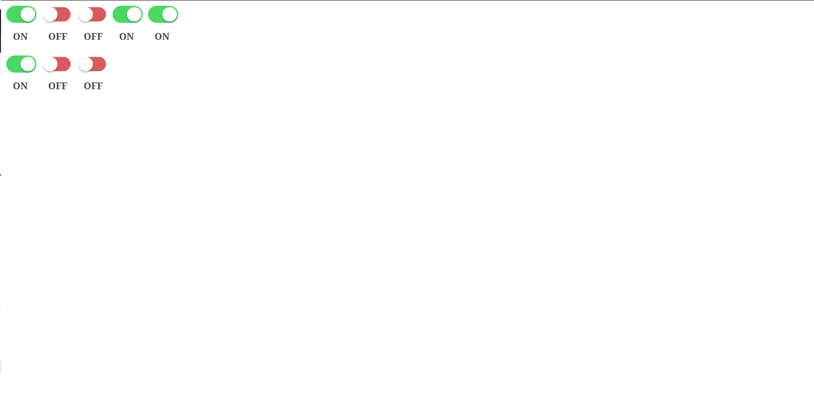

# New_Riego

### En esta primera seccion hemos hecho el primer apartado del examen. Este primer apartado consisitia en modificar el texto del checkbutton dependiendo de si su estado estuviera a false o true.

#### para la realizacion de dicho apartado unicamente he tocado el check.js

##### Captura del codigo hecho: 

### En esta segunda seccion he hecho el segundo apartado del examen. Este segundo apartado consistia en obtener los grupos de valvulas y sus valvulas correspondientes del servidor y una vez hecho eso pintarlo con la configuracion que nos viene del servidor.

#### Para la realizacion de dicho apartado he creado una constante ServiceClient que es el objeto que se va a encargar de manejar la conexion entre el cliente y el servidor. Tiene un metodo getChecksServed que me devuelve las valvulas del servidor con sus grupos.

#### Ademas he creado una clase UI para manejar el apartado grafico del cliente.

##### Captura de como ha quedado: 

#### En esta imagen se pueden ver las valvulas creadas correctamente y cada una con el estado que le llega del servidor.

